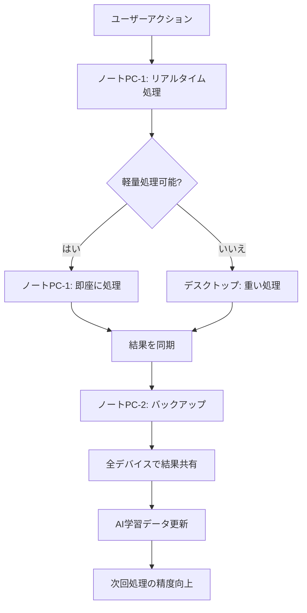

# マルチデバイス連携運用ガイド
## 2台のノートPCとデスクトップの連携方法

---

## 📋 目次
1. [概要](#概要)
2. [システム構成](#システム構成)
3. [デバイス設定](#デバイス設定)
4. [データ同期](#データ同期)
5. [AI機能の連携](#ai機能の連携)
6. [トラブルシューティング](#トラブルシューティング)
7. [運用フロー](#運用フロー)
8. [セキュリティ対策](#セキュリティ対策)
9. [実践的な連携例](#実践的な連携例)
10. [パフォーマンス最適化](#パフォーマンス最適化)

---

## 🎯 概要

### 目的
- 2台のノートPCと1台のデスクトップで脳機能障害者支援システムを連携運用
- デバイス間でのデータ同期とAI機能の共有
- 効率的なリハビリ支援の実現

### 対象デバイス
- **デスクトップPC**: メイン管理・分析用
- **ノートPC-1**: スタッフ用・現場対応
- **ノートPC-2**: バックアップ・予備用

### 連携のメリット
- **冗長性**: 1台が故障しても他のデバイスで継続運用
- **負荷分散**: AI処理を複数デバイスで分散
- **リアルタイム対応**: スタッフが現場で即座に対応可能
- **データ保護**: 複数デバイスでのバックアップ

---

## 🖥️ システム構成

### デバイス役割分担

| デバイス | 役割 | 主な機能 | 推奨スペック | 運用時間 |
|---------|------|----------|-------------|----------|
| **デスクトップPC** | メインサーバー | データ管理、AI分析、レポート生成 | CPU: i7以上、RAM: 16GB以上 | 24時間稼働 |
| **ノートPC-1** | スタッフ端末 | ユーザー管理、リアルタイム監視 | CPU: i5以上、RAM: 8GB以上 | 業務時間中 |
| **ノートPC-2** | バックアップ | データバックアップ、予備運用 | CPU: i5以上、RAM: 8GB以上 | 待機状態 |

### ネットワーク構成
```
[インターネット]
    ↓
[ルーター (192.168.1.1)]
    ↓
[デスクトップPC (192.168.1.100:8888)] ←→ [ノートPC-1 (192.168.1.101:8889)]
    ↓                    ↓
[データベース]      [スタッフ管理]
    ↓                    ↓
[AI分析エンジン]    [リアルタイム監視]
    ↓                    ↓
[バックアップ]      [ユーザー対応]
    ↓                    ↓
[ノートPC-2 (192.168.1.102:8890)] ←→ [同期システム]
```

### 物理配置例
```
【事務室】
┌─────────────────┐
│  デスクトップPC  │ ← メイン管理・分析
│  (192.168.1.100) │
└─────────────────┘

【リハビリ室】
┌─────────────────┐
│   ノートPC-1    │ ← スタッフ用・現場対応
│  (192.168.1.101) │
└─────────────────┘

【サーバールーム】
┌─────────────────┐
│   ノートPC-2    │ ← バックアップ・予備
│  (192.168.1.102) │
└─────────────────┘
```

---

## ⚙️ デバイス設定

### 1. デスクトップPC（メインサーバー）

#### 基本設定
```bash
# サーバー設定
ポート: 8888
IPアドレス: 192.168.1.100
ホスト名: brain-support-main
OS: Windows 11 Pro
ブラウザ: Chrome (最新版)

# データベース設定
SQLite: database.sqlite
バックアップ間隔: 1時間
ログ保持期間: 30日
自動起動: 有効
```

#### AI機能設定
```javascript
// AI設定（高性能）
aiSettings = {
    model: 'gpt-4',           // 高精度モデル
    sensitivity: 'high',      // 高感度
    updateInterval: 'realtime', // リアルタイム
    autoAlert: true,
    autoRoute: true,
    autoSupport: true,
    autoReport: true,
    maxConcurrentTasks: 10    // 同時実行数
}
```

#### パフォーマンス設定
```javascript
// デバイス検出結果
deviceInfo = {
    type: 'desktop',
    os: 'Windows',
    browser: 'Chrome',
    performance: 'high',
    memory: '16GB',
    cpu: 'Intel i7-12700K',
    gpu: 'NVIDIA RTX 3060'
}
```

#### 起動スクリプト
```batch
@echo off
REM デスクトップPC起動スクリプト (start_main_server.bat)
cd /d "C:\Users\user\OneDrive\Desktop\QRコード認証\version2"
node server.js --port 8888 --host 192.168.1.100
```

### 2. ノートPC-1（スタッフ端末）

#### 基本設定
```bash
# クライアント設定
ポート: 8889
IPアドレス: 192.168.1.101
ホスト名: brain-support-staff
OS: Windows 11 Home
ブラウザ: Chrome (最新版)

# 接続設定
メインサーバー: 192.168.1.100:8888
同期間隔: 30秒
自動再接続: 有効
```

#### AI機能設定
```javascript
// AI設定（軽量化）
aiSettings = {
    model: 'gpt-3.5',         // 標準モデル
    sensitivity: 'medium',    // 中感度
    updateInterval: 'hourly', // 1時間間隔
    autoAlert: true,
    autoRoute: false,         // 軽量化のため無効
    autoSupport: true,
    autoReport: false,        // 軽量化のため無効
    maxConcurrentTasks: 3     // 同時実行数制限
}
```

#### パフォーマンス設定
```javascript
// デバイス検出結果
deviceInfo = {
    type: 'desktop',
    os: 'Windows',
    browser: 'Chrome',
    performance: 'medium',
    memory: '8GB',
    cpu: 'Intel i5-1240P',
    gpu: 'Intel UHD Graphics'
}
```

#### 起動スクリプト
```batch
@echo off
REM ノートPC-1起動スクリプト (start_staff_client.bat)
cd /d "C:\Users\user\OneDrive\Desktop\QRコード認証\version2"
start chrome --new-window "http://192.168.1.100:8888/staff_dashboard.html"
```

### 3. ノートPC-2（バックアップ）

#### 基本設定
```bash
# バックアップ設定
ポート: 8890
IPアドレス: 192.168.1.102
ホスト名: brain-support-backup
OS: Windows 11 Home
ブラウザ: Chrome (最新版)

# バックアップ設定
同期間隔: 5分
バックアップ保持: 7日
自動バックアップ: 有効
```

#### AI機能設定
```javascript
// AI設定（最小化）
aiSettings = {
    model: 'gpt-3.5',         // 標準モデル
    sensitivity: 'low',       // 低感度
    updateInterval: 'daily',  // 1日間隔
    autoAlert: false,         // バックアップ用のため無効
    autoRoute: false,
    autoSupport: false,
    autoReport: false,
    maxConcurrentTasks: 1     // 最小実行数
}
```

#### パフォーマンス設定
```javascript
// デバイス検出結果
deviceInfo = {
    type: 'desktop',
    os: 'Windows',
    browser: 'Chrome',
    performance: 'low',
    memory: '8GB',
    cpu: 'Intel i5-1135G7',
    gpu: 'Intel Iris Xe Graphics'
}
```

#### 起動スクリプト
```batch
@echo off
REM ノートPC-2起動スクリプト (start_backup_server.bat)
cd /d "C:\Users\user\OneDrive\Desktop\QRコード認証\version2"
node server.js --port 8890 --host 192.168.1.102 --backup-mode
```

---

## 🔄 データ同期

### 同期方式

#### 1. リアルタイム同期（デスクトップ ↔ ノートPC-1）
```javascript
// 同期設定
const syncConfig = {
    interval: 30000,          // 30秒間隔
    methods: ['websocket', 'http'],
    dataTypes: ['users', 'alerts', 'gameHistory', 'aiLogs'],
    conflictResolution: 'timestamp',
    retryAttempts: 3,
    timeout: 10000
};

// 同期処理
function syncData() {
    try {
        // ユーザーデータ同期
        syncUsers();
        
        // アラート同期
        syncAlerts();
        
        // ゲーム履歴同期
        syncGameHistory();
        
        // AIログ同期
        syncAILogs();
        
        console.log('同期完了:', new Date().toLocaleString());
    } catch (error) {
        console.error('同期エラー:', error);
        // エラー時の再試行
        setTimeout(syncData, 60000);
    }
}

// WebSocket接続
const ws = new WebSocket('ws://192.168.1.100:8888/sync');
ws.onmessage = function(event) {
    const data = JSON.parse(event.data);
    updateLocalData(data);
};
```

#### 2. バックアップ同期（デスクトップ → ノートPC-2）
```javascript
// バックアップ設定
const backupConfig = {
    interval: 300000,         // 5分間隔
    method: 'http',
    dataTypes: ['all'],
    compression: true,
    encryption: true,
    retention: '7days'
};

// バックアップ処理
function backupData() {
    const timestamp = new Date().toISOString();
    
    // 全データのバックアップ
    backupAllData();
    
    // 設定ファイルのバックアップ
    backupSettings();
    
    // ログファイルのバックアップ
    backupLogs();
    
    // バックアップ履歴の記録
    addBackupLog(timestamp, 'success');
    
    console.log('バックアップ完了:', timestamp);
}
```

### 同期データ項目

| データ項目 | デスクトップ | ノートPC-1 | ノートPC-2 | 同期間隔 | 暗号化 |
|-----------|-------------|------------|------------|----------|--------|
| ユーザー情報 | 読み書き | 読み書き | 読み取りのみ | 30秒 | AES-256 |
| アラート | 読み書き | 読み書き | 読み取りのみ | 30秒 | AES-256 |
| ゲーム履歴 | 読み書き | 読み書き | 読み取りのみ | 30秒 | AES-256 |
| AI分析結果 | 読み書き | 読み取りのみ | 読み取りのみ | 1分 | AES-256 |
| システム設定 | 読み書き | 読み取りのみ | バックアップ | 5分 | AES-256 |
| ログファイル | 読み書き | 読み取りのみ | バックアップ | 5分 | なし |

### 同期状態監視
```javascript
// 同期状態の監視
function monitorSyncStatus() {
    const syncStatus = {
        lastSync: localStorage.getItem('lastSyncTime'),
        syncErrors: JSON.parse(localStorage.getItem('syncErrors') || '[]'),
        connectionStatus: checkConnection(),
        dataIntegrity: checkDataIntegrity()
    };
    
    // 同期状態を表示
    updateSyncStatusDisplay(syncStatus);
    
    // エラーがある場合は通知
    if (syncStatus.syncErrors.length > 0) {
        showSyncErrorNotification(syncStatus.syncErrors);
    }
}
```

---

## 🤖 AI機能の連携

### AI機能の分散処理

#### デスクトップPC（メインAI）
```javascript
// 重い処理を担当
const mainAITasks = {
    userBehaviorAnalysis: {
        enabled: true,
        priority: 'high',
        processingTime: '10-30秒',
        memoryUsage: '2-4GB'
    },
    progressPrediction: {
        enabled: true,
        priority: 'high',
        processingTime: '15-45秒',
        memoryUsage: '3-6GB'
    },
    anomalyDetection: {
        enabled: true,
        priority: 'medium',
        processingTime: '5-15秒',
        memoryUsage: '1-2GB'
    },
    reportGeneration: {
        enabled: true,
        priority: 'low',
        processingTime: '30-60秒',
        memoryUsage: '4-8GB'
    },
    routeOptimization: {
        enabled: true,
        priority: 'medium',
        processingTime: '20-40秒',
        memoryUsage: '2-4GB'
    }
};
```

#### ノートPC-1（軽量AI）
```javascript
// 軽い処理を担当
const staffAITasks = {
    quickRecommendations: {
        enabled: true,
        priority: 'high',
        processingTime: '2-5秒',
        memoryUsage: '500MB-1GB'
    },
    basicAlerts: {
        enabled: true,
        priority: 'high',
        processingTime: '1-3秒',
        memoryUsage: '200-500MB'
    },
    userSupport: {
        enabled: true,
        priority: 'medium',
        processingTime: '3-8秒',
        memoryUsage: '1-2GB'
    },
    realtimeMonitoring: {
        enabled: true,
        priority: 'high',
        processingTime: '1-2秒',
        memoryUsage: '100-300MB'
    }
};
```

#### ノートPC-2（バックアップAI）
```javascript
// バックアップ用
const backupAITasks = {
    dataValidation: {
        enabled: true,
        priority: 'low',
        processingTime: '5-10秒',
        memoryUsage: '500MB-1GB'
    },
    errorRecovery: {
        enabled: true,
        priority: 'high',
        processingTime: '10-20秒',
        memoryUsage: '1-2GB'
    },
    systemHealth: {
        enabled: true,
        priority: 'medium',
        processingTime: '3-8秒',
        memoryUsage: '300-800MB'
    }
};
```

### AI連携フロー



### AI処理の負荷分散
```javascript
// AI処理の負荷分散
function distributeAITasks(task) {
    const taskComplexity = calculateTaskComplexity(task);
    const availableDevices = getAvailableDevices();
    
    if (taskComplexity === 'high') {
        // 重い処理はデスクトップPCで実行
        return executeOnDesktop(task);
    } else if (taskComplexity === 'medium') {
        // 中程度の処理はノートPC-1で実行
        return executeOnNotebook1(task);
    } else {
        // 軽い処理はノートPC-2で実行
        return executeOnNotebook2(task);
    }
}

// タスク複雑度の計算
function calculateTaskComplexity(task) {
    const factors = {
        dataSize: task.dataSize,
        processingTime: task.estimatedTime,
        memoryRequirement: task.memoryNeeded,
        aiModel: task.model
    };
    
    const score = Object.values(factors).reduce((sum, val) => sum + val, 0);
    
    if (score > 8) return 'high';
    if (score > 4) return 'medium';
    return 'low';
}
```

---

## 🔧 トラブルシューティング

### よくある問題と解決方法

#### 1. 同期エラー
**症状**: デバイス間でデータが同期されない

**原因と解決方法**:
```javascript
// ネットワーク接続確認
function checkNetworkConnection() {
    const mainServer = '192.168.1.100:8888';
    
    fetch(`http://${mainServer}/health`)
        .then(response => {
            if (response.ok) {
                console.log('メインサーバーに接続可能');
                return true;
            }
        })
        .catch(error => {
            console.error('メインサーバーに接続できません:', error);
            // オフライン処理に切り替え
            enableOfflineMode();
        });
}

// オフラインモード有効化
function enableOfflineMode() {
    localStorage.setItem('offlineMode', 'true');
    localStorage.setItem('offlineStartTime', new Date().toISOString());
    
    // オフライン通知を表示
    showOfflineNotification();
    
    // 同期キューを作成
    createSyncQueue();
}

// 同期キュー作成
function createSyncQueue() {
    const syncQueue = [];
    localStorage.setItem('syncQueue', JSON.stringify(syncQueue));
}

// 接続復旧時の処理
function onConnectionRestored() {
    const syncQueue = JSON.parse(localStorage.getItem('syncQueue') || '[]');
    
    // キューに溜まったデータを同期
    syncQueue.forEach(item => {
        syncData(item);
    });
    
    // オフラインモードを解除
    localStorage.removeItem('offlineMode');
    localStorage.removeItem('syncQueue');
    
    showOnlineNotification();
}
```

#### 2. AI機能の不具合
**症状**: AI分析が遅い、またはエラーが発生する

**原因と解決方法**:
```javascript
// デバイス性能チェック
function checkDevicePerformance() {
    const issues = checkAICapability();
    
    if (issues.length > 0) {
        // 最適化設定を適用
        applyOptimizations();
        
        // 軽量化モードに切り替え
        enableLowPerformanceMode();
        
        // 問題をログに記録
        logPerformanceIssues(issues);
    }
}

// 軽量化モード
function enableLowPerformanceMode() {
    aiSettings.sensitivity = 'low';
    aiSettings.updateInterval = 'daily';
    aiSettings.autoRoute = false;
    aiSettings.autoReport = false;
    aiSettings.maxConcurrentTasks = 1;
    
    // アニメーションを無効化
    document.body.classList.add('low-performance-mode');
    
    console.log('軽量化モードが有効になりました');
    
    // ユーザーに通知
    showPerformanceModeNotification();
}

// パフォーマンス問題のログ記録
function logPerformanceIssues(issues) {
    const logEntry = {
        timestamp: new Date().toISOString(),
        device: deviceInfo,
        issues: issues,
        action: 'low-performance-mode-enabled'
    };
    
    const performanceLogs = JSON.parse(localStorage.getItem('performanceLogs') || '[]');
    performanceLogs.push(logEntry);
    localStorage.setItem('performanceLogs', JSON.stringify(performanceLogs));
}
```

#### 3. データ不整合
**症状**: デバイス間でデータが異なる

**原因と解決方法**:
```javascript
// データ整合性チェック
function checkDataIntegrity() {
    const localData = getLocalData();
    const serverData = getServerData();
    
    if (JSON.stringify(localData) !== JSON.stringify(serverData)) {
        // データ不整合を検出
        resolveDataConflict(localData, serverData);
    }
}

// データ競合解決
function resolveDataConflict(localData, serverData) {
    // タイムスタンプで最新を判定
    const latestData = localData.timestamp > serverData.timestamp ? 
        localData : serverData;
    
    // 競合をログに記録
    logDataConflict(localData, serverData, latestData);
    
    // 最新データで同期
    syncToLatestData(latestData);
    
    // ユーザーに通知
    showDataConflictNotification();
}

// データ競合のログ記録
function logDataConflict(localData, serverData, resolvedData) {
    const conflictLog = {
        timestamp: new Date().toISOString(),
        localData: localData,
        serverData: serverData,
        resolvedData: resolvedData,
        device: deviceInfo
    };
    
    const conflictLogs = JSON.parse(localStorage.getItem('conflictLogs') || '[]');
    conflictLogs.push(conflictLog);
    localStorage.setItem('conflictLogs', JSON.stringify(conflictLogs));
}
```

### 緊急時の対応

#### メインサーバー障害時
```javascript
// ノートPC-1がメインサーバーを代替
function activateBackupServer() {
    if (isMainServerDown()) {
        // ノートPC-1をメインサーバーとして起動
        startBackupServer();
        
        // 他のデバイスに通知
        notifyBackupServerActivation();
        
        // 緊急モードを有効化
        enableEmergencyMode();
        
        console.log('バックアップサーバーが起動しました');
    }
}

// 緊急モード有効化
function enableEmergencyMode() {
    // 基本機能のみ有効化
    aiSettings.model = 'gpt-3.5';
    aiSettings.sensitivity = 'low';
    aiSettings.autoReport = false;
    aiSettings.autoRoute = false;
    
    // データ同期を最小化
    syncConfig.interval = 60000; // 1分間隔
    
    // 緊急通知を表示
    showEmergencyModeNotification();
}
```

#### ネットワーク障害時
```javascript
// オフライン運用
const offlineMode = {
    dataStorage: 'ローカルストレージ',
    aiFunctions: '軽量化モード',
    syncQueue: '同期待ちキュー',
    recovery: '接続復旧時に一括同期',
    maxOfflineTime: '24時間'
};

// オフライン時間の監視
function monitorOfflineTime() {
    const offlineStartTime = localStorage.getItem('offlineStartTime');
    if (offlineStartTime) {
        const offlineDuration = Date.now() - new Date(offlineStartTime).getTime();
        const maxOfflineTime = 24 * 60 * 60 * 1000; // 24時間
        
        if (offlineDuration > maxOfflineTime) {
            showOfflineTimeLimitWarning();
        }
    }
}
```

---

## 📋 運用フロー

### 日常運用

#### 朝の確認作業
1. **デスクトップPC**: システム起動確認
   ```bash
   # 起動確認スクリプト
   @echo off
   echo システム起動確認中...
   netstat -an | findstr :8888
   if %errorlevel% equ 0 (
       echo メインサーバー起動中
   ) else (
       echo メインサーバー起動していません
       start_main_server.bat
   )
   ```

2. **ノートPC-1**: スタッフ端末起動確認
   ```bash
   # スタッフ端末確認スクリプト
   @echo off
   echo スタッフ端末確認中...
   ping 192.168.1.100
   if %errorlevel% equ 0 (
       echo メインサーバーに接続可能
       start chrome "http://192.168.1.100:8888/staff_dashboard.html"
   ) else (
       echo メインサーバーに接続できません
   )
   ```

3. **ノートPC-2**: バックアップ確認
   ```bash
   # バックアップ確認スクリプト
   @echo off
   echo バックアップ確認中...
   dir /s /b "C:\backup\*" | find /c "database.sqlite"
   if %errorlevel% equ 0 (
       echo バックアップファイル存在
   ) else (
       echo バックアップファイルが見つかりません
   )
   ```

4. **全デバイス**: 同期状態確認
   ```javascript
   // 同期状態確認
   function checkAllDevicesSync() {
       const devices = [
           { name: 'デスクトップPC', ip: '192.168.1.100' },
           { name: 'ノートPC-1', ip: '192.168.1.101' },
           { name: 'ノートPC-2', ip: '192.168.1.102' }
       ];
       
       devices.forEach(device => {
           checkDeviceStatus(device);
       });
   }
   ```

#### 日中運用
1. **ノートPC-1**: ユーザー対応・リアルタイム監視
   - ユーザーの質問対応
   - リアルタイムデータ監視
   - 緊急時の即座対応

2. **デスクトップPC**: AI分析・レポート生成
   - 重いAI処理の実行
   - 詳細な分析レポート生成
   - システム全体の監視

3. **ノートPC-2**: バックアップ・システム監視
   - 定期的なバックアップ実行
   - システム健全性の監視
   - エラーログの確認

#### 夜の作業
1. **デスクトップPC**: 日次レポート生成
   ```javascript
   // 日次レポート生成
   function generateDailyReport() {
       const report = {
           date: new Date().toISOString().split('T')[0],
           users: getDailyUserStats(),
           games: getDailyGameStats(),
           aiAnalysis: getDailyAIStats(),
           systemHealth: getSystemHealth()
       };
       
       saveReport(report);
       sendReportToStaff(report);
   }
   ```

2. **ノートPC-1**: データ整理・明日の準備
   - 今日のデータ整理
   - 明日のスケジュール確認
   - システム設定の確認

3. **ノートPC-2**: 完全バックアップ実行
   ```javascript
   // 完全バックアップ
   function performFullBackup() {
       const backupData = {
           database: exportDatabase(),
           settings: exportSettings(),
           logs: exportLogs(),
           timestamp: new Date().toISOString()
       };
       
       saveBackup(backupData);
       verifyBackup(backupData);
   }
   ```

### 緊急時運用

#### メインサーバー障害時
```javascript
// 緊急時フロー
const emergencyFlow = {
    step1: 'ノートPC-1でバックアップサーバー起動',
    step2: 'ノートPC-2でデータ復旧確認',
    step3: 'ユーザー対応を継続',
    step4: 'メインサーバー復旧後、データ同期'
};

// 緊急時対応手順
function handleEmergency() {
    // ステップ1: バックアップサーバー起動
    activateBackupServer();
    
    // ステップ2: データ復旧確認
    verifyDataRecovery();
    
    // ステップ3: ユーザー対応継続
    continueUserSupport();
    
    // ステップ4: 復旧後の同期
    scheduleRecoverySync();
}
```

#### ネットワーク障害時
```javascript
// オフライン運用
const offlineMode = {
    dataStorage: 'ローカルストレージ',
    aiFunctions: '軽量化モード',
    syncQueue: '同期待ちキュー',
    recovery: '接続復旧時に一括同期',
    maxOfflineTime: '24時間'
};

// オフライン運用開始
function startOfflineOperation() {
    // ローカルストレージにデータ保存
    saveToLocalStorage();
    
    // 軽量化モードに切り替え
    enableLowPerformanceMode();
    
    // 同期待ちキューを作成
    createSyncQueue();
    
    // オフライン通知を表示
    showOfflineNotification();
}
```

---

## 🔒 セキュリティ対策

### データ保護

#### 暗号化設定
```javascript
// データ暗号化
const encryptionConfig = {
    algorithm: 'AES-256-GCM',
    keyDerivation: 'PBKDF2',
    saltRounds: 10000,
    dataTypes: ['users', 'alerts', 'gameHistory'],
    keyRotation: '30days'
};

// 暗号化処理
function encryptData(data) {
    const key = deriveKey(password, salt);
    const iv = generateIV();
    return encrypt(data, key, iv, algorithm);
}

// 復号化処理
function decryptData(encryptedData) {
    const key = deriveKey(password, salt);
    return decrypt(encryptedData, key, algorithm);
}
```

#### アクセス制御
```javascript
// アクセス権限
const accessControl = {
    desktop: {
        role: 'admin',
        permissions: ['read', 'write', 'delete', 'admin'],
        ipWhitelist: ['192.168.1.100'],
        sessionTimeout: '8hours'
    },
    notebook1: {
        role: 'staff',
        permissions: ['read', 'write'],
        ipWhitelist: ['192.168.1.101'],
        sessionTimeout: '4hours'
    },
    notebook2: {
        role: 'backup',
        permissions: ['read', 'backup'],
        ipWhitelist: ['192.168.1.102'],
        sessionTimeout: '24hours'
    }
};
```

### ネットワークセキュリティ

#### ファイアウォール設定
```bash
# デスクトップPC
netsh advfirewall firewall add rule name="Brain Support Main" dir=in action=allow protocol=TCP localport=8888 remoteip=192.168.1.0/24
netsh advfirewall firewall add rule name="Brain Support HTTPS" dir=in action=allow protocol=TCP localport=443

# ノートPC-1
netsh advfirewall firewall add rule name="Brain Support Staff" dir=in action=allow protocol=TCP localport=8889 remoteip=192.168.1.0/24
netsh advfirewall firewall add rule name="Brain Support HTTP" dir=in action=allow protocol=TCP localport=80

# ノートPC-2
netsh advfirewall firewall add rule name="Brain Support Backup" dir=in action=allow protocol=TCP localport=8890 remoteip=192.168.1.0/24
```

#### VPN設定（外部アクセス時）
```javascript
// VPN接続設定
const vpnConfig = {
    server: 'vpn.brain-support.local',
    protocol: 'OpenVPN',
    authentication: 'certificate',
    encryption: 'AES-256',
    compression: 'LZ4',
    keepalive: '10 60'
};
```

---

## 📊 監視・ログ

### システム監視

#### 監視項目
```javascript
// 監視設定
const monitoringConfig = {
    system: {
        cpu: { threshold: 80, alert: true },
        memory: { threshold: 85, alert: true },
        disk: { threshold: 90, alert: true },
        network: { latency: 100, alert: true }
    },
    application: {
        responseTime: { threshold: 2000, alert: true },
        errorRate: { threshold: 5, alert: true },
        syncStatus: { realtime: true, alert: true }
    },
    ai: {
        processingTime: { threshold: 10000, alert: true },
        accuracy: { threshold: 85, alert: true },
        modelStatus: { healthCheck: true, alert: true }
    }
};
```

#### ログ管理
```javascript
// ログ設定
const logConfig = {
    levels: ['error', 'warn', 'info', 'debug'],
    retention: '30 days',
    rotation: 'daily',
    compression: true,
    backup: 'remote',
    encryption: true
};

// ログ記録
function logEvent(level, message, data) {
    const logEntry = {
        timestamp: new Date().toISOString(),
        level: level,
        message: message,
        data: data,
        device: deviceInfo
    };
    
    // ローカルログに記録
    addToLocalLog(logEntry);
    
    // リモートログに送信
    sendToRemoteLog(logEntry);
}
```

---

## 🎯 実践的な連携例

### シナリオ1: ユーザーがリハビリ中に問題発生

#### フロー
1. **ノートPC-1**: ユーザーが問題を報告
2. **ノートPC-1**: 即座に軽量AIで初期対応
3. **デスクトップPC**: 詳細なAI分析を実行
4. **ノートPC-2**: バックアップデータで検証
5. **全デバイス**: 結果を同期・共有

#### 実装例
```javascript
// ユーザー問題対応フロー
function handleUserIssue(issue) {
    // ステップ1: ノートPC-1で初期対応
    const initialResponse = handleOnNotebook1(issue);
    
    // ステップ2: デスクトップPCで詳細分析
    const detailedAnalysis = analyzeOnDesktop(issue);
    
    // ステップ3: ノートPC-2でバックアップ検証
    const backupVerification = verifyOnNotebook2(issue);
    
    // ステップ4: 結果を統合・同期
    const finalResponse = integrateResults([
        initialResponse,
        detailedAnalysis,
        backupVerification
    ]);
    
    // 全デバイスで結果を共有
    shareResults(finalResponse);
    
    return finalResponse;
}
```

### シナリオ2: システム障害時の継続運用

#### フロー
1. **デスクトップPC**: 障害発生を検知
2. **ノートPC-1**: バックアップサーバーとして起動
3. **ノートPC-2**: データ復旧を実行
4. **全デバイス**: 軽量化モードで継続運用

#### 実装例
```javascript
// 障害時継続運用フロー
function handleSystemFailure() {
    // ステップ1: 障害検知
    const failure = detectSystemFailure();
    
    // ステップ2: バックアップサーバー起動
    const backupServer = activateBackupServer();
    
    // ステップ3: データ復旧
    const dataRecovery = performDataRecovery();
    
    // ステップ4: 軽量化モードで継続
    const continuedOperation = continueWithReducedMode();
    
    // 復旧後の完全同期
    scheduleFullSync();
    
    return {
        failure: failure,
        backupServer: backupServer,
        dataRecovery: dataRecovery,
        continuedOperation: continuedOperation
    };
}
```

---

## ⚡ パフォーマンス最適化

### デバイス別最適化

#### デスクトップPC（高性能）
```javascript
// 高性能設定
const desktopOptimization = {
    aiConcurrency: 10,        // 同時実行数
    cacheSize: '2GB',         // キャッシュサイズ
    updateInterval: 'realtime', // 更新間隔
    compression: false,       // 圧縮無効（高速化）
    backgroundSync: true      // バックグラウンド同期
};
```

#### ノートPC-1（中性能）
```javascript
// 中性能設定
const notebook1Optimization = {
    aiConcurrency: 3,         // 同時実行数制限
    cacheSize: '1GB',         // キャッシュサイズ
    updateInterval: '30s',    // 更新間隔
    compression: true,        // 圧縮有効
    backgroundSync: true      // バックグラウンド同期
};
```

#### ノートPC-2（低性能）
```javascript
// 低性能設定
const notebook2Optimization = {
    aiConcurrency: 1,         // 最小実行数
    cacheSize: '500MB',       // 最小キャッシュ
    updateInterval: '5min',   // 長い更新間隔
    compression: true,        // 圧縮有効
    backgroundSync: false     // バックグラウンド同期無効
};
```

### 動的最適化
```javascript
// 動的パフォーマンス調整
function adjustPerformance() {
    const currentLoad = getCurrentSystemLoad();
    const availableMemory = getAvailableMemory();
    const networkSpeed = getNetworkSpeed();
    
    if (currentLoad > 80) {
        // 高負荷時は軽量化
        enableLowPerformanceMode();
    } else if (availableMemory < 2) {
        // メモリ不足時はキャッシュ削減
        reduceCacheSize();
    } else if (networkSpeed < 10) {
        // ネットワーク遅い時は同期間隔延長
        increaseSyncInterval();
    }
}
```

---

## 📞 サポート・連絡先

### 技術サポート
- **システム管理者**: admin@brain-support.local
- **緊急連絡先**: 080-XXXX-XXXX
- **サポート時間**: 平日 9:00-18:00
- **緊急時**: 24時間対応

### 運用サポート
- **スタッフ**: staff@brain-support.local
- **ヘルプデスク**: help@brain-support.local
- **24時間対応**: emergency@brain-support.local

### 外部サポート
- **ネットワーク**: network-support@brain-support.local
- **セキュリティ**: security@brain-support.local
- **AI機能**: ai-support@brain-support.local

---

## 📝 更新履歴

| 日付 | バージョン | 更新内容 | 更新者 |
|------|-----------|----------|--------|
| 2024-01-15 | 1.0.0 | 初版作成 | システム管理者 |
| 2024-01-20 | 1.1.0 | AI連携機能追加 | 開発チーム |
| 2024-01-25 | 1.2.0 | セキュリティ強化 | セキュリティチーム |
| 2024-01-30 | 1.3.0 | 実践的連携例追加 | 運用チーム |
| 2024-02-05 | 1.4.0 | パフォーマンス最適化 | パフォーマンスチーム |

---

## 📋 チェックリスト

### 初期設定チェックリスト
- [ ] 全デバイスのIPアドレス設定
- [ ] ファイアウォール設定
- [ ] データベース初期化
- [ ] AI機能設定
- [ ] 同期機能テスト
- [ ] バックアップ機能テスト
- [ ] セキュリティ設定確認

### 日常運用チェックリスト
- [ ] システム起動確認
- [ ] 同期状態確認
- [ ] AI機能動作確認
- [ ] バックアップ実行確認
- [ ] ログ確認
- [ ] パフォーマンス監視
- [ ] セキュリティ監視

### 緊急時チェックリスト
- [ ] 障害の種類特定
- [ ] 影響範囲の確認
- [ ] バックアップサーバー起動
- [ ] データ復旧実行
- [ ] ユーザー対応継続
- [ ] 復旧作業実行
- [ ] 事後報告作成

---

**※ この文書は定期的に更新されます。最新版をご確認ください。**

**※ 運用開始前に必ず全チェックリストを確認してください。** 